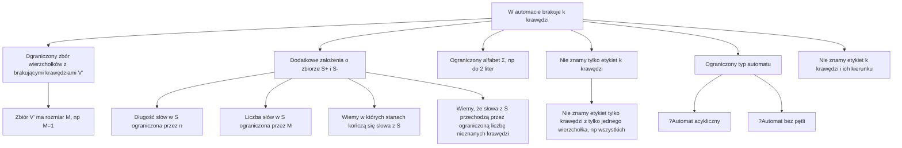

# Analiza problemu uzupełniania brakujących krawędzi w automacie skończonym

## Problemset
### Zmienne problemu
- `S+` - zbiór słów pozytywnych
- `S-` - zbiór słów negatywnych
- `S` - zbiór wszystkich słów ($S = S_+ \cup S_-$)
- `E` - zbiór krawędzi w oryginalnym automacie
- `V` - zbiór wierzchołków automatu
- `n` - liczba stanów w oryginalnym automacie
- `k` - liczba brakujących krawędzi
- `m` - maksymalna długość słowa w zbiorze S
- $\Sigma$ - alfabet

### Złożoności
#### Dowolna liczba brakujących krawędzi
NP-zupełny

#### Ograniczona liczba brakujących krawędzi
| Podejście | Czas | Pamięć | Uwagi |
|-----------|------|--------|-------|
| Bruteforce | $O(n^k * size(S) * m)$ |  | Sprawdzamy wszystkie możliwe miejsca połączenia k krawędzi |

### Podproblemy

### Ciekawe idee
- preprocessing 
  - prosty: pozbywanie się zbędnych próbek, etc
  - złożony: grupowanie stanów, etc
- caching
- drzewo prefiksowe dla S

### Pomysły do rozważenia
#### Preprocessing dla S
- Dla każdego słowa, dla każdej pozycji oraz długości podsłowa pamiętać gdzie najdalej możemy skoczyć - aby nie łazić po jego cyklu.  
Da to nakład pamięciowy $O(|S| * m^2)$ (co może można też sprytnie poprawić).  
*Wtedy przechodząc słowem $s$ po automacie, mamy gwarancję, że każdy stan odwiedzimy maksymalnie $O(1)$ razy - w pp musielibyśmy chodzić po jakimś cyklu w grafie, co moglibyśmy wykryć i korzystając z policzonych skoków ominąć.*  - **no nie wiem**  
Wtedy złożoność bruteforce to $O(n^k * |S| * n + |S| * m^2) = O(|S|(n^{k} + m^2))$.  

- Inny, oparty na tym pomysł: gdyby policzyć dla każdego sufiksu oraz stanu, gdzie najdalej możemy skoczyć?  
Wtedy efektywnie chodzimy w automacie tylko między nieznanymi krawędziami.  
  - Co gdy się pętlimy ciągle między tymi krawędziami?
  - Czy da się szybko policzyć takie skoki? - tak mi się wydaje, zwykła rekurencja z memoizacją już nie przechodzi?
Jeżeli tak, to mamy $O(n * |S| * m)$ pamięci i preprocessingu + trzeba policzyć co to wgl daje przy wykonaniu?  
Otrzymujemy swego rodzaju przekształcony/skompresowany automat, gdzie od razu połączone są stany posiadające nieznane krawędzie.  
Wtedy złożoność bruteforce to $O(n^k * |S| * k + n * |S| * m) = O(|S|(n^{k} * k + n*m))$.  
**tych funkcji w środku jest $n^n$**  
**może nie warto zapisywać dla każdego stanu** - to coś daje?  

